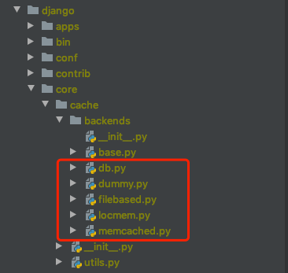

# DRF

[DRF官方文档](https://www.django-rest-framework.org/)

[Classy Django REST Framework](http://www.cdrf.co/)

## 请求和响应


### Requests


```
# GET
request.query_params

# POST | PUT | PATCH
request.data
```


```
request.user
request.method
request.content_type
request.META
request.session
```


APIView request封装

```python
class APIView(View):
  
    def initialize_request(self, request, *args, **kwargs):
      """
          Returns the initial request object.
          """
      parser_context = self.get_parser_context(request)

      return Request(
        request,
        parsers=self.get_parsers(),
        authenticators=self.get_authenticators(),
        negotiator=self.get_content_negotiator(),
        parser_context=parser_context
      )
```


*request.py*

```python
class Request:
    """
    Wrapper allowing to enhance a standard `HttpRequest` instance.

    Kwargs:
        - request(HttpRequest). The original request instance.
        - parsers(list/tuple). The parsers to use for parsing the
          request content.
        - authenticators(list/tuple). The authenticators used to try
          authenticating the request's user.
    """

    def __init__(self, request, parsers=None, authenticators=None,
                 negotiator=None, parser_context=None):
        assert isinstance(request, HttpRequest), (
            'The `request` argument must be an instance of '
            '`django.http.HttpRequest`, not `{}.{}`.'
            .format(request.__class__.__module__, request.__class__.__name__)
        )

        self._request = request
        self.parsers = parsers or ()
        self.authenticators = authenticators or ()
        self.negotiator = negotiator or self._default_negotiator()
        self.parser_context = parser_context
        self._data = Empty
        self._files = Empty
        self._full_data = Empty
        self._content_type = Empty
        self._stream = Empty

        if self.parser_context is None:
            self.parser_context = {}
        self.parser_context['request'] = self
        self.parser_context['encoding'] = request.encoding or settings.DEFAULT_CHARSET

        force_user = getattr(request, '_force_auth_user', None)
        force_token = getattr(request, '_force_auth_token', None)
        if force_user is not None or force_token is not None:
            forced_auth = ForcedAuthentication(force_user, force_token)
            self.authenticators = (forced_auth,)

    def __repr__(self):
        return '<%s.%s: %s %r>' % (
            self.__class__.__module__,
            self.__class__.__name__,
            self.method,
            self.get_full_path())

    def _default_negotiator(self):
        return api_settings.DEFAULT_CONTENT_NEGOTIATION_CLASS()

    @property
    def content_type(self):
        meta = self._request.META
        return meta.get('CONTENT_TYPE', meta.get('HTTP_CONTENT_TYPE', ''))

    @property
    def stream(self):
        """
        Returns an object that may be used to stream the request content.
        """
        if not _hasattr(self, '_stream'):
            self._load_stream()
        return self._stream

    @property
    def query_params(self):
        """
        More semantically correct name for request.GET.
        """
        return self._request.GET

    @property
    def data(self):
        if not _hasattr(self, '_full_data'):
            self._load_data_and_files()
        return self._full_data

    @property
    def user(self):
        """
        Returns the user associated with the current request, as authenticated
        by the authentication classes provided to the request.
        """
        if not hasattr(self, '_user'):
            with wrap_attributeerrors():
                self._authenticate()
        return self._user

    @user.setter
    def user(self, value):
        """
        Sets the user on the current request. This is necessary to maintain
        compatibility with django.contrib.auth where the user property is
        set in the login and logout functions.

        Note that we also set the user on Django's underlying `HttpRequest`
        instance, ensuring that it is available to any middleware in the stack.
        """
        self._user = value
        self._request.user = value

    @property
    def auth(self):
        """
        Returns any non-user authentication information associated with the
        request, such as an authentication token.
        """
        if not hasattr(self, '_auth'):
            with wrap_attributeerrors():
                self._authenticate()
        return self._auth

    @auth.setter
    def auth(self, value):
        """
        Sets any non-user authentication information associated with the
        request, such as an authentication token.
        """
        self._auth = value
        self._request.auth = value

    @property
    def successful_authenticator(self):
        """
        Return the instance of the authentication instance class that was used
        to authenticate the request, or `None`.
        """
        if not hasattr(self, '_authenticator'):
            with wrap_attributeerrors():
                self._authenticate()
        return self._authenticator

    def _load_data_and_files(self):
        """
        Parses the request content into `self.data`.
        """
        if not _hasattr(self, '_data'):
            self._data, self._files = self._parse()
            if self._files:
                self._full_data = self._data.copy()
                self._full_data.update(self._files)
            else:
                self._full_data = self._data

            # if a form media type, copy data & files refs to the underlying
            # http request so that closable objects are handled appropriately.
            if is_form_media_type(self.content_type):
                self._request._post = self.POST
                self._request._files = self.FILES

    def _load_stream(self):
        """
        Return the content body of the request, as a stream.
        """
        meta = self._request.META
        try:
            content_length = int(
                meta.get('CONTENT_LENGTH', meta.get('HTTP_CONTENT_LENGTH', 0))
            )
        except (ValueError, TypeError):
            content_length = 0

        if content_length == 0:
            self._stream = None
        elif not self._request._read_started:
            self._stream = self._request
        else:
            self._stream = io.BytesIO(self.body)

    def _supports_form_parsing(self):
        """
        Return True if this requests supports parsing form data.
        """
        form_media = (
            'application/x-www-form-urlencoded',
            'multipart/form-data'
        )
        return any([parser.media_type in form_media for parser in self.parsers])

    def _parse(self):
        """
        Parse the request content, returning a two-tuple of (data, files)

        May raise an `UnsupportedMediaType`, or `ParseError` exception.
        """
        media_type = self.content_type
        try:
            stream = self.stream
        except RawPostDataException:
            if not hasattr(self._request, '_post'):
                raise
            # If request.POST has been accessed in middleware, and a method='POST'
            # request was made with 'multipart/form-data', then the request stream
            # will already have been exhausted.
            if self._supports_form_parsing():
                return (self._request.POST, self._request.FILES)
            stream = None

        if stream is None or media_type is None:
            if media_type and is_form_media_type(media_type):
                empty_data = QueryDict('', encoding=self._request._encoding)
            else:
                empty_data = {}
            empty_files = MultiValueDict()
            return (empty_data, empty_files)

        parser = self.negotiator.select_parser(self, self.parsers)

        if not parser:
            raise exceptions.UnsupportedMediaType(media_type)

        try:
            parsed = parser.parse(stream, media_type, self.parser_context)
        except Exception:
            # If we get an exception during parsing, fill in empty data and
            # re-raise.  Ensures we don't simply repeat the error when
            # attempting to render the browsable renderer response, or when
            # logging the request or similar.
            self._data = QueryDict('', encoding=self._request._encoding)
            self._files = MultiValueDict()
            self._full_data = self._data
            raise

        # Parser classes may return the raw data, or a
        # DataAndFiles object.  Unpack the result as required.
        try:
            return (parsed.data, parsed.files)
        except AttributeError:
            empty_files = MultiValueDict()
            return (parsed, empty_files)

    def _authenticate(self):
        """
        Attempt to authenticate the request using each authentication instance
        in turn.
        """
        for authenticator in self.authenticators:
            try:
                user_auth_tuple = authenticator.authenticate(self)
            except exceptions.APIException:
                self._not_authenticated()
                raise

            if user_auth_tuple is not None:
                self._authenticator = authenticator
                self.user, self.auth = user_auth_tuple
                return

        self._not_authenticated()

    def _not_authenticated(self):
        """
        Set authenticator, user & authtoken representing an unauthenticated request.

        Defaults are None, AnonymousUser & None.
        """
        self._authenticator = None

        if api_settings.UNAUTHENTICATED_USER:
            self.user = api_settings.UNAUTHENTICATED_USER()
        else:
            self.user = None

        if api_settings.UNAUTHENTICATED_TOKEN:
            self.auth = api_settings.UNAUTHENTICATED_TOKEN()
        else:
            self.auth = None

    def __getattr__(self, attr):
        """
        If an attribute does not exist on this instance, then we also attempt
        to proxy it to the underlying HttpRequest object.
        """
        try:
            return getattr(self._request, attr)
        except AttributeError:
            return self.__getattribute__(attr)

    @property
    def DATA(self):
        raise NotImplementedError(
            '`request.DATA` has been deprecated in favor of `request.data` '
            'since version 3.0, and has been fully removed as of version 3.2.'
        )

    @property
    def POST(self):
        # Ensure that request.POST uses our request parsing.
        if not _hasattr(self, '_data'):
            self._load_data_and_files()
        if is_form_media_type(self.content_type):
            return self._data
        return QueryDict('', encoding=self._request._encoding)

    @property
    def FILES(self):
        # Leave this one alone for backwards compat with Django's request.FILES
        # Different from the other two cases, which are not valid property
        # names on the WSGIRequest class.
        if not _hasattr(self, '_files'):
            self._load_data_and_files()
        return self._files

    @property
    def QUERY_PARAMS(self):
        raise NotImplementedError(
            '`request.QUERY_PARAMS` has been deprecated in favor of `request.query_params` '
            'since version 3.0, and has been fully removed as of version 3.2.'
        )

    def force_plaintext_errors(self, value):
        # Hack to allow our exception handler to force choice of
        # plaintext or html error responses.
        self._request.is_ajax = lambda: value

```


### Response

```
Response(data, status=None, template_name=None, headers=None, content_type=None)
```


*HttpResponse 和 Response 区别*

```
from django.http.response import JsonResponse, HttpResponse

from rest_framework.response import Response  # api | json | xml | yaml
```


## 解析器和渲染器


### parsers

- JSONParser
- FormParser
- MultiPartParser
- FileUploadParser

### renderers

*.venv/lib/python3.6/site-packages/rest_framework/renderers.py*

- JSONRenderer
- BrowsableAPIRenderer
- AdminRenderer
- 
- TemplateHTMLRenderer
- StaticHTMLRenderer
- HTMLFormRenderer
- DocumentationRenderer


```bash
$ pip install djangorestframework-csv

// https://github.com/mjumbewu/django-rest-framework-csv
```


## 视图


### APIView

```python
from rest_framework.exceptions import NotFound
from rest_framework.response import Response
from rest_framework.views import APIView

from .models import Publisher


# Create your views here.


class PublisherApiView(APIView):

    def get_object(self, pk):
        try:
            return Publisher.objects.get(pk=pk)
        except Publisher.DoesNotExist:
            raise NotFound()

    def get(self, request, format=None, *args, **kwargs):
        if kwargs.get("pk"):
            # 查看单条数据
            p = self.get_object(kwargs['pk'])
            data = p.serializer()
        else:
            # 查询全部数据
            ps = Publisher.objects.all()
            data = [p.serializer() for p in ps]
        return Response({
            "code": 0,
            "data": data,
            "message": "",
        })

    def post(self, request):
        data = request.data

        p = Publisher.objects.create(**data)
        return Response({
            "code": 0,
            "data": p.serializer(),
            "message": "",
        })

    def put(self, request, *args, **kwargs):
        data = request.data

        count = Publisher.objects.filter(pk=kwargs['pk']).update(**data)
        # 受影响的行数
        if count == 0:
            return Response({
                "code": -1,
                "data": "",
                "message": "Update fail, please check.",
            })
        else:
            return Response({
                "code": 0,
                "data": "",
                "message": f"{count} record is updated.",
            })

    def delete(self, request, *args, **kwargs):
        p = self.get_object(kwargs['pk'])
        p.delete()
        return Response({
            "code": 0,
            "data": "",
            "message": "Delete ok.",
        })

```


*封装*

*base/response.py*

```python
def JSONAPIResponse(code, data=None, message=None):
    return Response({
        "code": 0,
        "data": data,
        "message": message,
    })
```


*views.py*

```python
from rest_framework.exceptions import NotFound
from rest_framework.views import APIView

from base.response import JSONAPIResponse
from .models import Publisher


# Create your views here.


class PublisherApiView(APIView):

    def get_object(self, pk):
        try:
            return Publisher.objects.get(pk=pk)
        except Publisher.DoesNotExist:
            raise NotFound()

    def get(self, request, format=None, *args, **kwargs):
        if kwargs.get("pk"):
            # 查看单条数据
            p = self.get_object(kwargs['pk'])
            data = p.serializer()
        else:
            # 查询全部数据
            ps = Publisher.objects.all()
            data = [p.serializer() for p in ps]
        return JSONAPIResponse(code=0, data=data, message=None)

    def post(self, request):
        data = request.data

        p = Publisher.objects.create(**data)
        return JSONAPIResponse(code=0, data=p.serializer(), message=None)

    def put(self, request, *args, **kwargs):
        data = request.data

        count = Publisher.objects.filter(pk=kwargs['pk']).update(**data)
        # 受影响的行数
        if count == 0:
            return JSONAPIResponse(code=-1, data=None, message="Update fail, please check.")
        else:
            return JSONAPIResponse(code=0, data=None, message=f"{count} record is updated.")

    def delete(self, request, *args, **kwargs):
        p = self.get_object(kwargs['pk'])
        p.delete()
        return JSONAPIResponse(code=0, data=None, message="Delete ok.")

```


### GenericAPIView

> 通用视图

在学 `通用试图`之前，需要先学习 序列化。


- serializer_class
- filter_backends
- pagination_class


```python

urlpatterns = [
    path('v1/publisher', views.PublisherApiView.as_view()),
    path('v1/publisher/<int:pk>/', views.PublisherApiView.as_view()),

    path('v2/publisher', views.PublisherGenericAPIView.as_view()),
    path('v3/publisher', views.PublisherListAPIView.as_view()),
    path('v4/publisher/<int:pk>/', views.PublisherRetrieveAPIView.as_view()),
    path('v5/publisher/<int:pk>/', views.PublisherDestroyAPIView.as_view()),
    path('v6/publisher', views.PublisherCreateAPIView.as_view()),
]
```


```python
from rest_framework.generics import GenericAPIView, ListAPIView, RetrieveAPIView, DestroyAPIView, CreateAPIView
from .models import Publisher
from .serializers import PublisherModelSerializer

class PublisherGenericAPIView(GenericAPIView):
    queryset = Publisher.objects.all()
    serializer_class = PublisherModelSerializer


class PublisherListAPIView(ListAPIView):
    queryset = Publisher.objects.all()
    serializer_class = PublisherModelSerializer


class PublisherRetrieveAPIView(RetrieveAPIView):
    queryset = Publisher.objects.all()
    serializer_class = PublisherModelSerializer


class PublisherDestroyAPIView(DestroyAPIView):
    queryset = Publisher.objects.all()
    serializer_class = PublisherModelSerializer


class PublisherCreateAPIView(CreateAPIView):
    queryset = Publisher.objects.all()
    serializer_class = PublisherModelSerializer
```


大家自已练习 组合视图

```
ListCreateAPIView
RetrieveUpdateAPIView
RetrieveDestroyAPIView
RetrieveUpdateDestroyAPIView

```


### ViewSet

> 视图集 视图的集合

必须配合 `router` 来使用才行


```python
from rest_framework.viewsets import ModelViewSet


class PublisherModelViewSet(ModelViewSet):
    queryset = Publisher.objects.all()
    serializer_class = PublisherModelSerializer
```


### 总结

**APIView** 不涉及到 Model 的操作

**GenericAPIView** 提供分页，很少直接使用

**ViewSet** 涉及到 Model 的操作

## 路由

### SimpleRouter

功能清单

- 快速生成 viewset 对象的url映射关系
- 提供额外的 **action**


```python
from myapp.permissions import IsAdminOrIsSelf
from rest_framework.decorators import action

class UserViewSet(ModelViewSet):
    ...

    @action(methods=['post'], detail=True, permission_classes=[IsAdminOrIsSelf])
    def set_password(self, request, pk=None):
      	pass
```


### DefaultRouter

相比于 SimpleRouter，DefaultRouter 提供了 api root view，返回了包含 viewset 中包含 的所有 action 超链接.


**建议**

工作中建议直接使用 DefaultRouter 即可，主要针对 ViewSet 视图集。


**例子**

```python
from django.contrib import admin
from django.urls import path, include
from rest_framework import routers

from apps.book import urls as book_urls
from apps.book.router import book_router

router = routers.DefaultRouter()
router.registry.extend(book_router.registry)

API_URLS = []
API_URLS.extend(book_urls.urlpatterns)
API_URLS.extend(router.urls)

# https://docs.djangoproject.com/en/3.1/topics/http/urls/
urlpatterns = [
    path('admin/', admin.site.urls),
    path('api/', include(API_URLS)),
]
```


## 序列化


**序列化**     将数据库里的数据渲染到客户端； 或者将 Model 转换成 Python 的数据类型，比如 JSON

**反序列化** 将客户端发来的数据，首先解析数据到 Python 的数据类型，然后验证数据到合法性，最后何以存储到数据库中。


### serializers 

### ModelSerializer

```python
from .models import Publisher
from .models import Book

from rest_framework import serializers
from rest_framework.serializers import ModelSerializer


class PublisherModelSerializer(ModelSerializer):
    name = serializers.CharField()

    class Meta:
        model = Publisher

        # 序列化
        # 要返回的字段
        fields = ['id', 'name', 'address', 'create_time', "update_time"]

        # 反序列化
        # 字段验证是否必传
        read_only_fields = ['address']

    def validate_name(self, value):
        # 单字段验证
        print(f"value: {value}")
        if value.startswith(" ") or value.endswith(" "):
            raise serializers.ValidationError("开头和结尾不能有空格")
        return value

    def validate(self, data):
        # 全局验证
        print(f"data: {data}")
        return data


```


```python
  serializer = self.get_serializer(data=request.data)      
  
  class BaseSerializer(Field):
    """
    The BaseSerializer class provides a minimal class which may be used
    for writing custom serializer implementations.

    Note that we strongly restrict the ordering of operations/properties
    that may be used on the serializer in order to enforce correct usage.

    In particular, if a `data=` argument is passed then:

    .is_valid() - Available.
    .initial_data - Available.
    .validated_data - Only available after calling `is_valid()`
    .errors - Only available after calling `is_valid()`
    .data - Only available after calling `is_valid()`

    If a `data=` argument is not passed then:

    .is_valid() - Not available.
    .initial_data - Not available.
    .validated_data - Not available.
    .errors - Not available.
    .data - Available.
    """

    def __init__(self, instance=None, data=empty, **kwargs):
        self.instance = instance
        if data is not empty:
            self.initial_data = data
        self.partial = kwargs.pop('partial', False)
        self._context = kwargs.pop('context', {})
        kwargs.pop('many', None)
        super().__init__(**kwargs)
  
  
  	def save(......):
  			validated_data = {**self.validated_data, **kwargs}

        # self.instance = None
        if self.instance is not None:
            self.instance = self.update(self.instance, validated_data)
            assert self.instance is not None, (
                '`update()` did not return an object instance.'
            )
        else:
            self.instance = self.create(validated_data)
            assert self.instance is not None, (
                '`create()` did not return an object instance.'
            )

        return self.instance
```


### ListSerializer

最后在讲这个哦


- to_representation
- to_internal_value


### 校验

- 方式1

```
address = serializers.CharField(read_only=True)
# address = serializers.ReadOnlyField()

read_only=True
write_only=True

如果在序列化类中写入read_only=True，那么在反序列化时，这个字段是可传可不传，如果你传了我也不接收，存到数据中为空。

required=False
如果在序列化类中写入required=False，那么在反序列化时，这个字段是可传可不传，如果你传了就按照你传的保存，否则就是留空。
```

- 方式2

```
    class Meta:
        model = Publisher

        # 序列化
        # fields = ["name", "create_time"]
        fields = "__all__"

        # 反序列化
        # read_only_fields = ["address", ]
        extra_kwargs = {
            'address': {
                # 'write_only': True,
                'required': True,
                'min_length': 5,
                'max_length': 10,
                "error_messages": {
                    "required": "address 是必传参数.",
                    "min_length": "长度最小为5.",
                    "max_length": "长度最大为10.",
                },
            }
        }
```

- 方式3

> 对象级验证

```python
class PublisherModelSerializer(ModelSerializer):
    # address = serializers.CharField(read_only=True)
    # address = serializers.CharField(required=False)
    # address = serializers.ReadOnlyField()

    # 反序列化 校验
    def validate(self, attrs):
        print(f"attrs: {attrs}")
        if attrs.get('address'):
            if '-' not in attrs['address']:
                raise ValidationError("address format error.")
        return attrs
```

- 方式4

>  字段级验证


- 方式5


**优先级顺序**

Meta.extra_kwargs. -> validate_address -> validate


## 分页

> .venv/lib/python3.6/site-packages/rest_framework/pagination.py

### PageNumberPagination

```python
class CustomPageNumberPagination(PageNumberPagination):
    # 设置
    page_size_query_param = "page_size"

    # 一页显示多少条数据
    # 默认值
    page_size = 5

    # 最大值
    max_page_size = 10
```


```
[1,2,3,4,5,6,7,8,9,10,11,12,13,14,15,16,17,18,19,20,21]

?page=1&page_size=10

?page=2&page_size=10
```


### LimitOffsetPagination

```python
class CustomLimitOffsetPagination(LimitOffsetPagination):
    # 默认显示多少条数据
    default_limit = 5
```


```
[1,2,3,4,5,6,7,8,9,10,11,12,13,14,15,16,17,18,19,20,21]

?offset=5&limit=5

offset 是偏移
limit 来控制数量
```


### CursorPagination


**全局**

```
# REST_FRAMEWORK = {
#     # Pagination
#     'DEFAULT_PAGINATION_CLASS': 'rest_framework.pagination.PageNumberPagination',
#     'PAGE_SIZE': 5,
# }
```


https://www.cnblogs.com/catgatp/p/12879228.html

## 搜索

### SearchFilter

### OrderingFilter

### DjangoFilterBackend

- django-filter


**SearchFilter**

针对 **search_fields** 中的字段做模糊匹


**OrderingFilter**

针对 **ordering_fields** 中的字段做排序(正序，倒序)


**DjangoFilterBackend**

重点讲这个

- 用法
  - 和**SearchFilter**有相同之处，不同之处**SearchFilter**是按照固定的key，然后按照Value搜索，而**DjangoFilterBackend**是按照字段和值一一匹配的。
  - 自定义过滤器  ---> 最重要的点

针对 **filterset_fields** 中的字段做匹配，和**search_fields**有不同之处。

- 安装

```bash
$ pip install django-filter

$ vim ops11/settings.py
INSTALLED_APPS = [
    ...
    'django_filters',
    ...
]
```

- 例子

```python
from rest_framework.filters import SearchFilter
from rest_framework.filters import OrderingFilter
from django_filters import rest_framework as filters


class BaseModelViewSet(ModelViewSet):
    # authentication_classes = [SessionAuthentication, TokenAuthentication]
    # permission_classes = [IsAuthenticated, IsAdminUser]
    authentication_classes = []
    permission_classes = []
    pagination_class = CustomPageNumberPagination
    filter_backends = [SearchFilter, OrderingFilter, filters.DjangoFilterBackend]
    # SearchFilter
    # search=<field>
    # 针对要搜索的字段列表
    search_fields = []

    # OrderingFilter
    # ?ordering=account,username
    # ?ordering=username
    # ?ordering=-username
    ordering_fields = []

    # filters.DjangoFilterBackend
    # https://django-filter.readthedocs.io/en/stable/
    filterset_class = None
    # 等价匹配
    # ?category=clothing&in_stock=True
    filterset_fields = ['category', 'in_stock']
```


*filters.py*

```python
import django_filters

from apps.user.models import UserProfile
from .models import Book


# Meta.fields
class BookV1Filter(django_filters.FilterSet):
    class Meta:
        model = Book
        # 精准查询
        # “relationship paths” using Django’s __ syntax to filter on fields on a related model
        fields = ['name', 'price', "publisher__name"]


class BookV2Filter(django_filters.FilterSet):
    class Meta:
        model = Book
        # 针对字段指定匹配条件
        # ?name=&price__lt=&price__gt=70&create_time__year__gt=
        fields = {
            'name': ['exact'],
            'price': ['lt', 'gt'],
            'create_time': ['year__gt'],
            'publisher__name': ['exact'],
            'authors__username': ['exact'],
        }


# 自定义
class BookFilter(django_filters.FilterSet):
    # 自定义搜索条件
    author_username = django_filters.CharFilter(method='my_custom_filter')

    class Meta:
        model = Book
        # 精准匹配
        # fields = ['name', 'price']
        fields = ["author_username", ]

    def my_custom_filter(self, queryset, name, value):
        """过滤作者等于author_username对书籍"""
        print(f"name: {name}")
        print(f"value: {value}")
        try:
            u = UserProfile.objects.get(username=value)
        except UserProfile.DoesNotExist:
            return queryset.none()

        return u.book_set.all()
        # return queryset.filter(**{
        #     name: value,
        # })

```


**问题点**

```
1. filter_class 和 filterset_class 有什么区别呀

filter_class 没有用过

2. 三个过滤器的优先级

SearchFilter  OrderingFilter 可以同时存在 并且点关系
/api/v21/book/boos/?search=good&ordering=price

SearchFilter  OrderingFilter 和 DjangoFilterBackend 不同同时
```


https://django-filter.readthedocs.io/en/stable/guide/rest_framework.html


## 限流

### AnonRateThrottle

### UserRateThrottle

### ScopedRateThrottle


作用于 `APIView`上

<!--不要用浏览器 或者是 隐身模式测试。最好用 Postman 测试-->

```python

class APIView(View):
  	...
    throttle_classes = api_settings.DEFAULT_THROTTLE_CLASSES
    ...
```


> .venv/lib/python3.6/site-packages/rest_framework/settings.py

```python
DEFAULTS = {
      'DEFAULT_THROTTLE_CLASSES': [],
}
```


## 异常


优先级

- 当前类
- ops11/settings.py 
- 默认
  - Api settings DEFAULTS


```python
    def get_exception_handler(self):
        """
        Returns the exception handler that this view uses.
        """
        return self.settings.EXCEPTION_HANDLER

```


```python
from rest_framework.views import exception_handler


def custom_exception_handler(exc, context):
    """
    :param exc: 异常
    :param context: 上下文
    :return: Response object
    """
    response = exception_handler(exc, context)
    if response is not None:
        detail = response.data.pop('detail')
        response.data['code'] = -1
        response.data['data'] = None
        response.data['message'] = detail
        response.data['request_id'] = ""

    return response
```


```python
REST_FRAMEWORK = {
    'EXCEPTION_HANDLER': 'base.exceptions.custom_exception_handler',
}
```


## 中间件

*ops11/middleware/.....*


```python
MIDDLEWARE = [
    'django.middleware.security.SecurityMiddleware',
    'django.contrib.sessions.middleware.SessionMiddleware',
    'django.middleware.common.CommonMiddleware',
    # 'django.middleware.csrf.CsrfViewMiddleware',
    'django.contrib.auth.middleware.AuthenticationMiddleware',
    'django.contrib.messages.middleware.MessageMiddleware',
    'django.middleware.clickjacking.XFrameOptionsMiddleware',
]
```


> .venv/lib/python3.6/site-packages/django/utils/decorators.py
>
> make_middleware_decorator

```python
import datetime

from django.utils.deprecation import MiddlewareMixin


class ExampleMiddleware(MiddlewareMixin):

    def process_request(self, request):
        print("This is process_request : ", datetime.datetime.now())
        return None

    def process_view(self, request, callback, callback_args, callback_kwargs):
        print("This is process_view : ", datetime.datetime.now())

    def process_exception(self, request, exception):
        print("This is process_exception : ", datetime.datetime.now())

    def process_template_response(self, request, response):
        return response

    def process_response(self, request, response):
        print("This is process_response : ", datetime.datetime.now())
        return response
```


*settings.py*

```python
MIDDLEWARE = [
    # custom
    'middleware.example.ExampleMiddleware',
]
```


### 例子


```python
import datetime
import json

from django.utils.deprecation import MiddlewareMixin
from rest_framework.response import Response

from apps.audit.models import AuditLog


class AuditMiddleware(MiddlewareMixin):
    pk = None

    def process_request(self, request):
        print("This is process_request : ", datetime.datetime.now())

        # Pprint(request.META.items())
        # for k, v in request.META.items():
        #     print(k, v)

        """
        PATH_INFO /api/v3/book/publisher
        REMOTE_ADDR 127.0.0.1
        # CONTENT_TYPE application/json
        REQUEST_METHOD GET
        QUERY_STRING name=%E6%B2%B3%E5%8D%97
        request.data
        request.user.username
        """

        # 白名单 过滤
        WHITE_LIST = [
            "/admin",
        ]
        for path in WHITE_LIST:
            if request.META['PATH_INFO'].startswith(path):
                return

        data = {
            "uri": request.META['PATH_INFO'],
            "method": request.META['REQUEST_METHOD'],
            "query_string": request.META['QUERY_STRING'],
            "username": request.user.username,
            "remote_ip": request.META['REMOTE_ADDR'],
        }

        try:
            data['body'] = json.loads(request.body)
        except json.decoder.JSONDecodeError:
            data['body'] = ""
        try:
            obj = AuditLog.objects.create(**data)  # pk = 2
        except:
            pass
        else:
            self.pk = obj.pk

    def process_view(self, request, callback, callback_args, callback_kwargs):
        print("This is process_view : ", datetime.datetime.now())

    def process_exception(self, request, exception):
        print("This is process_exception : ", datetime.datetime.now())
        try:
            al = AuditLog.objects.get(pk=self.pk)
        except AuditLog.DoesNotExist:
            pass
        else:
            al.status_code = -1
            al.save()

    def process_template_response(self, request, response):
        #
        return response

    def process_response(self, request, response):
        # print("This is process_response : ", datetime.datetime.now())
        print("This is process_response : ", datetime.datetime.now())
        if type(response) != Response:
            return response

        try:
            al = AuditLog.objects.get(pk=self.pk)
        except AuditLog.DoesNotExist:
            return response

        al.status_code = response.data['code']
        al.save()
        return response

```


## 缓存

### redis

原生支持的 **cache** 种类





**django-redis**


```bash
pip install django-redis
```


*注意 vm 要映射6379端口，否则无法连接到 redis 服务*

<!--不要用浏览器 或者是 隐身模式测试。最好用 Postman 测试-->

```python
// redis
CACHES = {
    "default": {
        "BACKEND": "django_redis.cache.RedisCache",
        "LOCATION": "redis://127.0.0.1:6379/1",
        "OPTIONS": {
            "CLIENT_CLASS": "django_redis.client.DefaultClient",
        }
    }
}


// local file
CACHES = {
    "default": {
        'BACKEND': 'django.core.cache.backends.filebased.FileBasedCache',
        'LOCATION': '/tmp/django_cache',
    }
}
```


https://docs.djangoproject.com/en/3.1/ref/settings/#caches

https://github.com/jazzband/django-redis


## 认证和权限


```python
class BaseModelViewSet(ModelViewSet):
    authentication_classes = [SessionAuthentication, TokenAuthentication]
    permission_classes = [IsAuthenticated, IsAdminUser]
```


**认证 & 权限**


### Token认证

```python
INSTALLED_APPS = [
    ...
    'rest_framework.authtoken'
]
```


```bash
$ make migrate
```


> user/management/command/bulk_generator_token.py

```python
from django.core.management.base import BaseCommand, CommandError

from apps.user.models import UserProfile
from rest_framework.authtoken.models import Token


class Command(BaseCommand):
    help = 'Bulk generator user token.'

    def handle(self, *args, **options):

        for user in UserProfile.objects.all():
            Token.objects.get_or_create(user=user)
```

```bash
# python manage.py bulk_generator_token
```


*urls.py*

```python
from rest_framework.authtoken import views
urlpatterns += [
    path('api-token-auth/', views.obtain_auth_token)
]
```


### JWT认证


```bash
$ pip install djangorestframework-jwt
```

`salt`

```python
from rest_framework_jwt.views import obtain_jwt_token
from rest_framework_jwt.views import refresh_jwt_token
from rest_framework_jwt.views import verify_jwt_token

urlpatterns = [
    # JWT AUTH
    path('api/api-token-auth/', obtain_jwt_token),
    path('api/api-token-refresh/', refresh_jwt_token),
    path('api/api-token-verify/', verify_jwt_token),
]
```


```python
JWT_AUTH = {
    'JWT_AUTH_HEADER_PREFIX': 'JWT',
    # 启用令牌刷新功能
    'JWT_ALLOW_REFRESH': True,

    # 过期时间 + REFRESH
    'JWT_REFRESH_EXPIRATION_DELTA': datetime.timedelta(days=2),

    # 过期时间
    'JWT_EXPIRATION_DELTA': datetime.timedelta(days=1),
}

```


[django-rest-framework-jwt github](https://github.com/jpadilla/django-rest-framework-jwt)

[django-rest-framework-jwt 文档](https://jpadilla.github.io/django-rest-framework-jwt/)

https://www.jianshu.com/p/0d9d8b56434e


## 源码

### request

### APIView

### SimpleRateThrottle

> .venv/lib/python3.6/site-packages/rest_framework/throttling.py

```python
""""
Provides various throttling policies.
"""
import time

from django.core.cache import cache as default_cache
from django.core.exceptions import ImproperlyConfigured

from rest_framework.settings import api_settings


// 基类
// 如果要实现requests限流，需要继承类，并重写 allow_request | get_ident | wait 三个方法
class BaseThrottle:
    """
    Rate throttling of requests.
    """

    def allow_request(self, request, view):
        """
        Return `True` if the request should be allowed, `False` otherwise.
        如果请求被允许 返回True 否则返回False
        """
        raise NotImplementedError('.allow_request() must be overridden')

    def get_ident(self, request):
      	// 通过 请求的来源IP 来限制
        // 获取来源IP 有2种方式 HTTP_X_FORWARDED_FOR and REMOTE_ADDR
        // 如果有代理 比如 nginx 来指定代理的个数 NUM_PROXIES
        """
        Identify the machine making the request by parsing HTTP_X_FORWARDED_FOR
        if present and number of proxies is > 0. If not use all of
        HTTP_X_FORWARDED_FOR if it is available, if not use REMOTE_ADDR.
        """
        xff = request.META.get('HTTP_X_FORWARDED_FOR')
        remote_addr = request.META.get('REMOTE_ADDR')
        num_proxies = api_settings.NUM_PROXIES  // 默认值是 None

        if num_proxies is not None:
            if num_proxies == 0 or xff is None:
                return remote_addr
            addrs = xff.split(',')
            client_addr = addrs[-min(num_proxies, len(addrs))]
            return client_addr.strip()

        return ''.join(xff.split()) if xff else remote_addr

    def wait(self):
        """
        Optionally, return a recommended number of seconds to wait before
        the next request.
        """
        return None


class SimpleRateThrottle(BaseThrottle):
    """
    A simple cache implementation, that only requires `.get_cache_key()`
    to be overridden.

    The rate (requests / seconds) is set by a `rate` attribute on the View
    class.  The attribute is a string of the form 'number_of_requests/period'.

    Period should be one of: ('s', 'sec', 'm', 'min', 'h', 'hour', 'd', 'day')

    Previous request information used for throttling is stored in the cache.
    """
    cache = default_cache
    timer = time.time
    cache_format = 'throttle_%(scope)s_%(ident)s'
    scope = None
    THROTTLE_RATES = api_settings.DEFAULT_THROTTLE_RATES

    def __init__(self):
        if not getattr(self, 'rate', None):
            self.rate = self.get_rate()
        self.num_requests, self.duration = self.parse_rate(self.rate)

    def get_cache_key(self, request, view):
        """
        Should return a unique cache-key which can be used for throttling.
        Must be overridden.

        May return `None` if the request should not be throttled.
        """
        raise NotImplementedError('.get_cache_key() must be overridden')

    def get_rate(self):
        """
        Determine the string representation of the allowed request rate.
        """
        if not getattr(self, 'scope', None):
            msg = ("You must set either `.scope` or `.rate` for '%s' throttle" %
                   self.__class__.__name__)
            raise ImproperlyConfigured(msg)

        try:
            return self.THROTTLE_RATES[self.scope]
        except KeyError:
            msg = "No default throttle rate set for '%s' scope" % self.scope
            raise ImproperlyConfigured(msg)

    def parse_rate(self, rate):
        """
        Given the request rate string, return a two tuple of:
        <allowed number of requests>, <period of time in seconds>
        """
        if rate is None:
            return (None, None)
        num, period = rate.split('/')
        num_requests = int(num)
        duration = {'s': 1, 'm': 60, 'h': 3600, 'd': 86400}[period[0]]
        return (num_requests, duration)

    def allow_request(self, request, view):
        """
        Implement the check to see if the request should be throttled.

        On success calls `throttle_success`.
        On failure calls `throttle_failure`.
        """
        if self.rate is None:
            return True

        self.key = self.get_cache_key(request, view)
        if self.key is None:
            return True

        self.history = self.cache.get(self.key, [])
        self.now = self.timer()
        print(f"hisitory -> {self.history}")
        print(f"now -> {self.now}", time.time())
        print(f"duration -> {self.duration}")
        print(f"num_requests -> {self.num_requests}")

        # Drop any requests from the history which have now passed the
        # throttle duration
        while self.history and self.history[-1] <= self.now - self.duration:
            self.history.pop()
        if len(self.history) >= self.num_requests:
            return self.throttle_failure()
        return self.throttle_success()

    def throttle_success(self):
        """
        Inserts the current request's timestamp along with the key
        into the cache.
        """
        self.history.insert(0, self.now)
        self.cache.set(self.key, self.history, self.duration)
        return True

    def throttle_failure(self):
        """
        Called when a request to the API has failed due to throttling.
        """
        return False

    def wait(self):
        """
        Returns the recommended next request time in seconds.
        """
        if self.history:
            remaining_duration = self.duration - (self.now - self.history[-1])
        else:
            remaining_duration = self.duration

        available_requests = self.num_requests - len(self.history) + 1
        if available_requests <= 0:
            return None

        return remaining_duration / float(available_requests)
      
      
class AnonRateThrottle(SimpleRateThrottle):
    """
    Limits the rate of API calls that may be made by a anonymous users.

    The IP address of the request will be used as the unique cache key.
    """
    scope = 'anon'

    def get_cache_key(self, request, view):
        if request.user.is_authenticated:
            return None  # Only throttle unauthenticated requests.

        return self.cache_format % {
            'scope': self.scope,
            'ident': self.get_ident(request)
        }


class UserRateThrottle(SimpleRateThrottle):
    """
    Limits the rate of API calls that may be made by a given user.

    The user id will be used as a unique cache key if the user is
    authenticated.  For anonymous requests, the IP address of the request will
    be used.
    """
    scope = 'user'

    def get_cache_key(self, request, view):
        if request.user.is_authenticated:
            ident = request.user.pk
        else:
            ident = self.get_ident(request)

        return self.cache_format % {
            'scope': self.scope,
            'ident': ident
        }
```


*APIView*

```python
class APIView(View):
  
  	throttle_classes = api_settings.DEFAULT_THROTTLE_CLASSES
    
    def check_throttles(self, request):
        """
        Check if request should be throttled.
        Raises an appropriate exception if the request is throttled.
        """
        throttle_durations = []
        for throttle in self.get_throttles():
          	// 调用对象的 allow_request
            if not throttle.allow_request(request, self):
              	// 如果
                throttle_durations.append(throttle.wait())

        if throttle_durations:
            # Filter out `None` values which may happen in case of config / rate
            # changes, see #1438
            durations = [
                duration for duration in throttle_durations
                if duration is not None
            ]

            duration = max(durations, default=None)
            self.throttled(request, duration)
            
            
    def get_throttles(self): // 对 throttle_classes 中每个限流类初始化生成对象
        """
        Instantiates and returns the list of throttles that this view uses.
        """
        return [throttle() for throttle in self.throttle_classes]
      
    
    def throttled(self, request, wait):
        """
        If request is throttled, determine what kind of exception to raise.
        """
        raise exceptions.Throttled(wait)  // 抛异常
```

## API文档


## 疑问🤔️

- GenericAPIView 和 APIView 的区别
-  ModelViewSet 中禁用 POST |  PUT 请求方式
-  View, APIView, ModelViewSet 使用场景


# 工具

## IDE

`command + option + L` 

`find`

## 断点&调试

`print`

`Debug`


以 **IDE** 的方式 启动Server， 在代码处打上**断点**，查看代码的请求流程 以及 代码逻辑。


# 部署

> nginx + gunicorn + supervisor


## gunicorn

**gunicorn 命令行**

```bash
$ gunicorn --worker-class=sync ops11.wsgi:application
$ gunicorn --worker-class=gevent ops11.wsgi:application

$ gunicorn ops11.wsgi:application -b 0.0.0.0:9000 -w 4 -k gthread
$ gunicorn ops11.wsgi:application -b 0.0.0.0:9000 -w 4 -k gthread  --thread 40 --max-requests 4096 --max-requests-jitter 512

$ pkill gunicorn
```


*config/gunicorn.conf.py*

```bash
import os
import sys
import multiprocessing


BASE_DIR = os.path.dirname(os.path.abspath(os.path.dirname(__file__)))
sys.path.append(BASE_DIR)

LOG_DIR = os.path.join(BASE_DIR, 'logs')
if not os.path.exists(LOG_DIR):
    os.makedirs(LOG_DIR)

# 绑定的ip与端口
port = 18891
bind = f"0.0.0.0:{port}"

# 以守护进程的形式后台运行
daemon = True

# 最大挂起的连接数，64-2048
backlog = 512

# 超时
timeout = 30

# 调试状态
debug = True

# gunicorn要切换到的目的工作目录
chdir = BASE_DIR

# 工作进程类型(默认的是 sync 模式，还包括 eventlet, gevent, or tornado, gthread, gaiohttp)
worker_class = 'sync'

# 工作进程数
workers = multiprocessing.cpu_count()

# 指定每个工作进程开启的线程数
threads = 1

# 日志级别，这个日志级别指的是错误日志的级别(debug、info、warning、error、critical)，而访问日志的级别无法设置
loglevel = 'debug'

# 日志格式
access_log_format = '%(t)s %(p)s %(h)s "%(r)s" %(s)s %(L)s %(b)s %(f)s" "%(a)s"'
# 其每个选项的含义如下：
'''
h          remote address
l          '-'
u          currently '-', may be user name in future releases
t          date of the request
r          status line (e.g. ``GET / HTTP/1.1``)
s          status
b          response length or '-'
f          referer
a          user agent
T          request time in seconds
D          request time in microseconds
L          request time in decimal seconds
p          process ID
'''

# 访问日志文件
accesslog = os.path.join(LOG_DIR, 'gunicorn_access.log')

# 错误日志文件
errorlog = os.path.join(LOG_DIR, 'gunicorn_error.log')

# 访问日志文件，"-" 表示标准输出
accesslog = "-"

# 错误日志文件，"-" 表示标准输出
errorlog = "-"
```

**启动**

```bash
$ gunicorn -c config/gunicorn.conf.py ops11.wsgi:application
```


*start.sh*

```bash
#!/bin/bash

proc_name="ops11"
ops11=`ps aux | grep gunicorn | grep -v grep | wc -l`
if [ "$ops11" -eq 0 ]; then
    gunicorn -c config/gunicorn.conf.py $proc_name.wsgi:application
fi

sleep 1
echo `ps aux | grep gunicorn | grep -v grep | wc -l`
```


*stop.sh*

```bash
#!/bin/bash

ps aux | grep gunicorn | grep -v grep | awk '{print $2 }' | xargs kill
```


## nginx

*config.d/ops11.conf*

```bash
server {
    listen 80;
    server_name _;

    location /api {
        proxy_pass http://127.0.0.1:9000;
        # add_header Access-Control-Allow-Origin *;
        # add_header Access-Control-Allow-Methods 'GET, POST, PUT, DELETE, OPTIONS, PATCH';
        # add_header Access-Control-Allow-Headers 'DNT,X-Mx-ReqToken,Keep-Alive,User-Agent,X-Requested-With,If-Modified-Since,Cache-Control,Content-Type,Authorization';

        # if ($request_method = 'OPTIONS') {
        #     return 204;
        # }
    }

    error_page 500 502 503 504 /50x.html;
    location = /50x.html {
        root html;
    }
}
```


## supervisor

```bash
// 安装
# pip install supervisor
# supervisord -v
4.2.2

// 配置
# echo_supervisord_conf
# echo_supervisord_conf > /etc/supervisord.conf
[include]
files = /etc/supervisor/*.conf

// 启动supervisord
# supervisord -c /etc/supervisord.conf
# ps -ef | grep supervisord

// 管控进程配置文件
# mkdir /etc/supervisor
# vim /etc/supervisor/ops11.conf
[program:ops11]
directory=/opt/ops
command=/opt/ops/.venv/bin/gunicorn ops.wsgi:application -b 0.0.0.0:9000 -w 4 -k gthread
autostart=true
autorestart=true
redirect_stderr=true
stdout_logfile=/opt/ops/logs/supervisor.log
startsecs=0
stopasgroup=true
killasgroup=true

// 命令行工具
# supervisorctl status
# supervisorctl stop ops11
# supervisorctl start ops11
# supervisorctl restart ops11
# supervisorctl reread
# supervisorctl update
```


```bash
# ps -ef |grep -v 'grep' | grep 9000 | awk '{ print $2 }' |xargs kill
```


http://supervisord.org/installing.html

https://www.jianshu.com/p/ff915e062f86

http://liyangliang.me/posts/2015/06/using-supervisor/


**异常**

https://stackoverflow.com/questions/40909842/supervisor-fatal-exited-too-quickly-process-log-may-have-details


# API 权限系统

> 采用开源组件 casbin 来开发


[casbin - github](https://github.com/casbin/pycasbin)


https://github.com/pycasbin/django-orm-adapter


## 分享 

### 云主机生命周期


# 其它

## 装饰器

> 装饰器的作用，如何写参数装饰器


```python
import signal
import time


class TimeoutError(Exception):
    pass


def timeout(seconds, error_message='Function call timed out'):
    def decorate(func):
        def wrapper(*args, **kwargs):
            def _handle_timeout(signum, frame):
                raise TimeoutError(error_message)

            signal.signal(signal.SIGALRM, _handle_timeout)
            signal.alarm(seconds)

            print("---> wrapper start")
            try:
                return func(*args, **kwargs)
            except TimeoutError:
                print("timeout err")
            finally:
                signal.alarm(0)
            print("---> wrapper stop")

        return wrapper

    return decorate


@timeout(3)
def pprint(*args, **kwargs):
    time.sleep(5)
    print(f"args: {args}, \nkwargs: {kwargs}")


pprint()

```


## 内存溢出

> python会发生内存溢出吗，如何解决优化


如果一个对象被另外一个对象长期的引用，并且没有释放


## queryset

> 当取出的queryset数据量特别大时如何优化处理


## GIL

> python的GIL, 什么时候释放GIL锁，互斥锁和Gil锁的关系


`GIL`  **global interpreter lock** 全局解释器锁

- 首先，要清楚，为什么要引入锁？

如果在单进程单线程模式中，其实是不需要锁，因为只有一个线程在操作，肯定是安全的；

只有在并发编程中才会有锁的概念，因为在并发编程中要保证数据的安全，防止同时对同一个资源操作，因此锁就是一种方式。


- 其次，什么是互斥锁？

加锁，释放锁

一旦一个线程T1加锁，在T1没有释放锁之前，其它线程只能处于等待的状态。

互斥锁是为了保证多个线程对同一个全局变量或者同一个资源操作时，保证数据是安全的。


引入了GIL，主要是为了保证多线程同一时间只能有一个线程运行

GIL 导致了多线程*并发*执行变成了*串行*执行，并且只能利用单核，适用于IO密集型，不适合CPU密集型。

如果想利用多核，就要用多进程模式。


https://www.huaweicloud.com/articles/904da24cc1d2997ca378ade718806ec0.html

https://cloud.tencent.com/developer/article/1597907


## 内存管理

> python垃圾回收机制


- 引用计数
- 追踪式垃圾回收
  - 标记和清除
  - 分代回收
- 内存池


https://read.douban.com/reader/ebook/1499455/?from=book

https://zhuanlan.zhihu.com/p/164627977

https://www.cnblogs.com/xybaby/p/7491656.html

https://zhuanlan.zhihu.com/p/65839740


